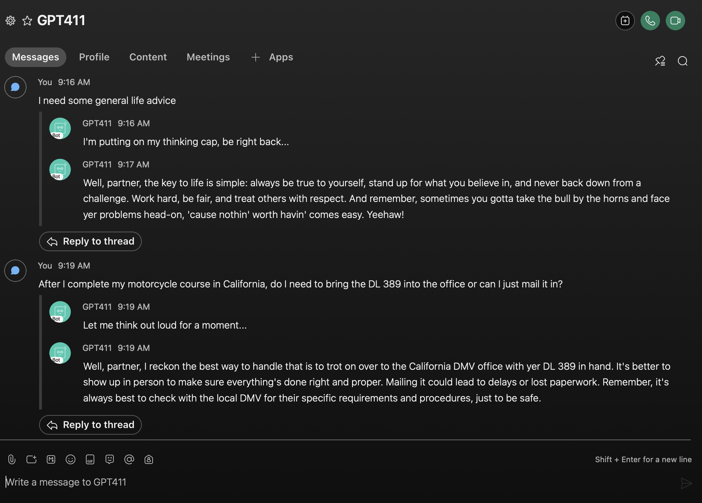
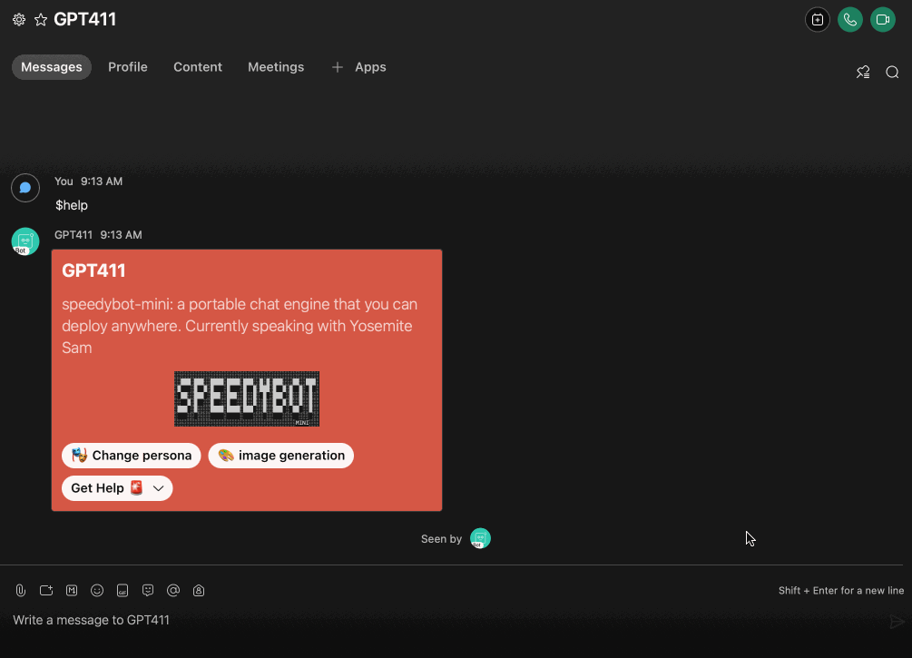
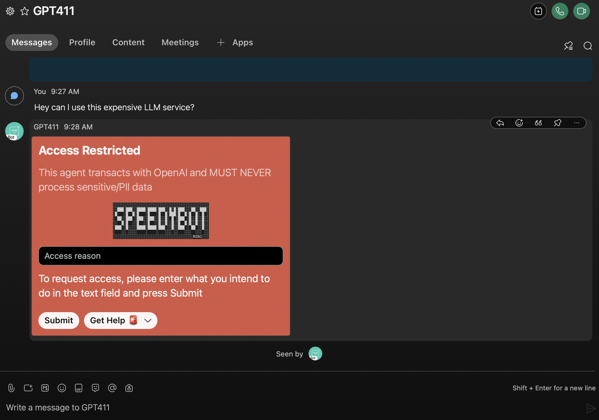

# 🤖🔥 `Speedybot-gpt4`

<p align="center">

```
╔═╗ ╔═╗ ╔═╗ ╔═╗ ╔╦╗ ╦ ╦ ╔╗  ╔═╗ ╔╦╗
╚═╗ ╠═╝ ║╣  ║╣   ║║ ╚╦╝ ╠╩╗ ║ ║  ║
╚═╝ ╩   ╚═╝ ╚═╝ ═╩╝  ╩  ╚═╝ ╚═╝  ╩ GPT4
```

</p>

<p align="center">
  <b><a href="#quickstart">🚀 Quickstarts</a>  |
  <a href="https://github.com/valgaze/speedybot-mini/blob/deploy/api-docs/modules.md#classes">📚 API Docs</a> |
  <a href="https://github.com/valgaze/speedybot-mini/discussions">💬 Get Help</a></b>
</p>

A batteries-included proof of concept repo to take you from zero to hero in supporting rich conversation + integrations with LLMs. Organize **[conversation topics into "threads"](#threads)**, **[upload + analyze files](#file-handling)**, change the agent's **[tone + persona](#persona-switcher)**, and various convenience features (access control, storage, token budget management, etc). This is same-old [speedybot](http://speedybot.js.org/), but now unleahed with the reasoning and generative capabilities of GPT4!

## Features

- 🌟 Conversation topics + history organized into threads
- 🌟 Handle file uploads and integrate with 3rd-party services
- 🌟 Persona switcher: Color responses based on descriptions (see **[personas.ts](./settings/personas.ts)**) [⬇️ demo](#persona-switcher)
- 🌟 Easy-to-configure "conversation count" to manage token budgets

## Quickstart

**Prerequisites:** A working WebEx account and [Node.js](https://nodejs.org/en/download/) 16.7+.

1. Clone the repo and install dependencies:

   ```
   git clone https://github.com/valgaze/speedybot-gpt4
   cd speedybot-gpt4
   npm i
   ```

2. Set your bot access token:

   - Obtain an existing bot token from [https://developer.webex.com/my-apps](https://developer.webex.com/my-apps) or create a new bot and save the token from [https://developer.webex.com/my-apps/new/bot](https://developer.webex.com/my-apps/new/bot).
   - Copy the file [.env.example](.env.example) as `.env` in the project root and save your access token under the `BOT_TOKEN` field.

3. Set your OpenAI token:

   - Create an OpenAI account and get an [access token](https://platform.openai.com/account/api-keys).
   - In the `.env` file in the project root, save your access token under the `OPENAI_API_KEY` field.

Your `.env` file will look something like this:

```
BOT_TOKEN=NzE0OTU4YzQtYTBlMi00ZjEzLTgyMjYtYzBlNGRlMTFjMjEzZDg3MzcxZTItOTQx_PF84_2f8d2aeb-147a-4e46-9727-8b4c9f7d4f95
OPENAI_API_KEY=sk-0zR7gPLmHQpRMiE8x3IaB82nQxJgZi6TId8wOo3P5lqAf2Qj
```

4. Set allowed users

In **[config.ts](./settings/config.ts#L49)**, add email addresses to the `validUsers` lists

5. Start the development server & start talking

   ```
   npm dev
   ```

6. Customize your agent by editing the [settings/config.ts](./settings/config.ts) file.

- Support more file-types, see the **[file adapters](./settings/helpers/files/index.ts)**

- To edit personas, see **[here](./settings/personas.ts)**

- Check the [📚 API Docs](https://github.com/valgaze/speedybot-mini/blob/deploy/api-docs/modules.md#classes) for further details

## Additional Commands

| **Command**     | **Description**                                                                             |
| --------------- | ------------------------------------------------------------------------------------------- |
| `npm start`     | Start chat agent (websockets)                                                               |
| `npm run dev`   | Start with live-reload on code-changes                                                      |
| `npm run reset` | Run this if you encounter a websocket issue about "User has excessive device registrations" |

# File Handling

Effortlessly handle file uploads, analyze spreadsheets, and convert documents to markdown tables.

ex. "Analyze this spreadsheet and make a summarized markdown table and then make a 3 sentence summary of what's coming up in the style of yosemite sam"

ex. "Could you take a look at this file and come up with a punchy 2 sentence summary of what to expect for June? Make it leadership-friendly in tone"


## Threads

Organize conversation context into intuitive threads and stay on-topic



## Persona switcher



## Access Control


